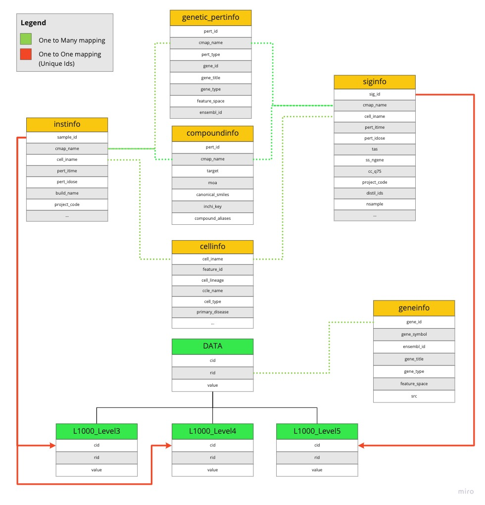
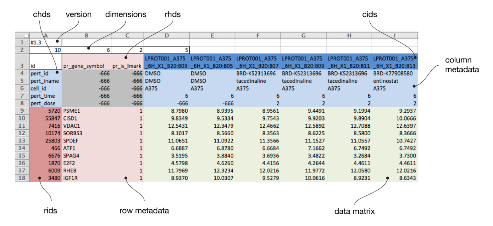

# DrugAI

## LINCS2020 Download

1. Data are download from [LINCS2020](https://clue.io/data/CMap2020#LINCS2020).

  - This data bundle is an expansion to the LINCS2017
  - Only compound data are downloaded. other data types are including:
    - oe: overexperssion
    - sh: knockdown
    - crispr: xpr
    - misc:

2. Gene Infer weights (landmark genes conversion matrix to 11350 genes) could be download from GEO:GSE92743

  - GSE92743_Broad_OLS_WEIGHTS_n979x11350.gctx

3. repurposing_drugs from [here](https://clue.io/data/REP#REP)

4. For this project, we only download compound data
  - GCTx: download contrl and treatment of level 3 data (trt_cp, ctr)
  - MetaData:
    - instinfo: level 3-4
    - siginfo: level 5
    - geneinfo
    - compoundinfo

## Data Query

- cmapPy: read GCTx
- cmapBQ: query LINCS database using bigQUERY

## Data Format
### data mapping here

### GCTx data format

