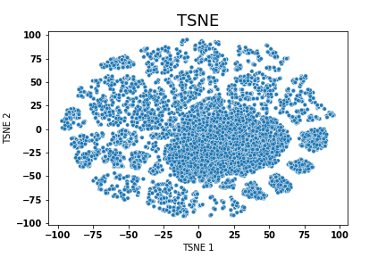

# DrugAI
### Drug Efficacy Prediction using Graph Neural Network


We implemented 3 GCN model for efficacy prediction:
- [DMPNN](https://pubs.acs.org/doi/10.1021/acs.jcim.9b00237)
- [GCN](https://arxiv.org/abs/1609.02907)
- [GIN](https://arxiv.org/abs/1905.12265>), see also [GINEConv](https://pytorch-geometric.readthedocs.io/en/latest/_modules/torch_geometric/nn/conv/gin_conv.html)


## Dependency
- numpy
- pandas
- python >= 3.7
- Pytorch >= 1.5
- Pytorch Geometric >= 1.7
- RDkit
- optuna: (optional) hyperparameter search


## Usage

### Input data

Need at least one file
1. a csv file with
  - first column: SIMILES
  - second to last column: float (regression), int (classification)

2. (optional) a pickle file with a tuple (train, test, val) of row indices (splits).

### 1. Train
```shell
python drug_gnn/train.py --data_path ${data} \
                        --task ${regression} \
                        --gnn_type dmpnn --log_dir checkpoints/dmpnn 
```

### 2. Predict
```shell
python drug_gnn/predict.py --data_path ${data} \
                        --task ${regression} \
                        --gnn_type dmpnn --log_dir checkpoints/dmpnn 
```

### Hyperparameter tuning
```shell
python drug_gnn/hyperopt.py --data_path ${data} --task ${regression}  \
                            --gnn_type dmpnn \
                            --hyperopt_dir hyper_dmpnn
```


## Drug Efficacy prediction
1. Train your model using LINCS 2020 Data
    - input data format: 
        - shape： (num_smiles, num_landmark_genes)
        - first column are SMILE strings
        - the rest columns are expression values
        - columns names should be Entrez IDs
    - save `best_model`

2. Prediction step will generate two output file
    -  Embeddings for each molecule: `xxx.embeddings.npy`
    -  Predicted Landmark genes expression: `xxx.pred.exprs.csv`


3. Efficacy Score:
    - 1. Prepare a up- or down-regulated gene signatures (Entrez ID only): up.txt, down.txt
    - 2. Get transform matrix: `GSE92743_Broad_OLS_WEIGHTS_n979x11350.gctx`
        ```python
           # convert to pandas DataFrame
           from cmapPy.pandasGEXpress.parse import parse
           weight = parse('GSE92743_Broad_OLS_WEIGHTS_n979x11350.gctx').data_df
           weight.to_csv("GSE92743_Broad_OLS_WEIGHTS_n979x11350.csv")
        ```
    - 3. Predicted output from step 2
    - 4. Run:
    ```shell
    python efficacy.py --weights GSE92743_Broad_OLS_WEIGHTS_n979x11350.csv \
                       --predicts xxx.pred.exprs.csv \
                       --up up.txt \
                       --down down.txt \
                       --output efficacy.csv
    ```


## Results
1. Average pearson's correlation (AUC-like plot) shows GNN works pretty good for predicting transcriptional profiles  


2. TSNE plot of drug's embeddings 




3. Pearson's coefficiency distribution


## Contact

Zhuoqing Fang: fangzq@stanford.edu

## Others

This project is based on [chemprop](https://github.com/chemprop/chemprop), and [chiral_gnn](https://github.com/PattanaikL/chiral_gnn)

